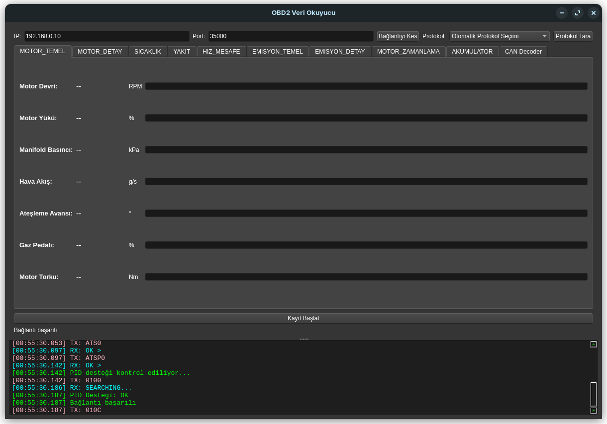
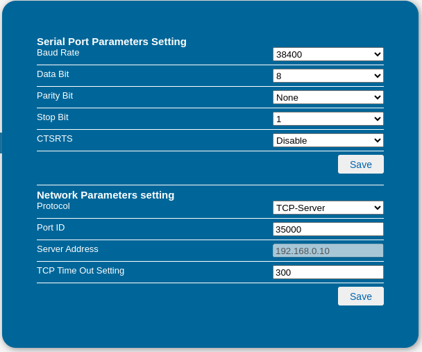

# OBD2 Veri Okuyucu

Bu proje, WiFi OBD2 cihazları için geliştirilmiş bir Python tabanlı veri okuma ve analiz aracıdır.

## Ekran Görüntüleri

### Ana Arayüz


### WiFi OBD2 Ayarları


## Özellikler

- WiFi OBD2 bağlantısı
- Gerçek zamanlı veri okuma
- Çoklu protokol desteği
- Otomatik protokol tarama
- CAN mesajı çözümleme
- CSV formatında veri kaydı
- Kategorize edilmiş sensör verileri
- Terminal görünümü
- Koyu tema arayüz

## Desteklenen Sensörler

### Motor Temel
- Motor Devri (RPM)
- Motor Yükü (%)
- Manifold Basıncı (kPa)
- Hava Akış (g/s)
- Ateşleme Avansı (°)
- Gaz Pedalı (%)
- Motor Torku (Nm)

### Sıcaklık
- Soğutma Suyu (°C)
- Yağ Sıcaklığı (°C)
- Şanzıman Sıcaklığı (°C)
- Emme Sıcaklığı (°C)
- Yakıt Sıcaklığı (°C)
- Katalizör Sıcaklıkları (°C)

### Yakıt Sistemi
- Yakıt Basıncı (kPa)
- Rail Basıncı (kPa)
- Yakıt Seviyesi (%)
- Yakıt Tüketimi (L/h)
- Yakıt Tipi
- Etanol Oranı (%)

### Emisyon Sistemi
- O2 Sensörleri (V)
- NOx Sensörleri (ppm)
- Partikül Sensörü (mg/m³)
- AdBlue Seviyesi (%)
- DPF Basıncı (kPa)
- DPF Sıcaklığı (°C)
- EGR Sistemi (%)

### Motor Zamanlama
- Kam Milleri Konumu (°)
- Krank Mili Konumu (°)
- VVT Değerleri (°)

### Diğer
- Araç Hızı (km/h)
- Mesafe (km)
- Akü Voltajı (V)
- Alternatör (V)

## Kurulum

1. Gereksinimleri yükleyin:
```bash
pip install -r requirements.txt
```

2. Programı çalıştırın:
```bash
python3 obd_gui.py
```

## WiFi OBD2 Cihaz Ayarları

1. WiFi OBD2 cihazınızı aracınıza takın
2. Cihazın WiFi ağına bağlanın
3. Varsayılan bağlantı ayarları:
   - IP: 192.168.0.10
   - Port: 35000
   - Protokol: TCP-Server

## Protokol Desteği

- SAE J1850 PWM (41.6K)
- SAE J1850 VPW (10.4K)
- ISO 9141-2
- ISO 14230-4 KWP (5 baud ve fast init)
- ISO 15765-4 CAN (11/29 bit, 250K/500K)
- SAE J1939 CAN

## Veri Kaydı

- Veriler CSV formatında kaydedilir
- Her kayıt için timestamp eklenir
- Kayıtlar `logs` klasöründe saklanır
- Dosya adı formatı: `obd2_log_YYYYMMDD_HHMMSS.csv`

## Lisans

MIT License 